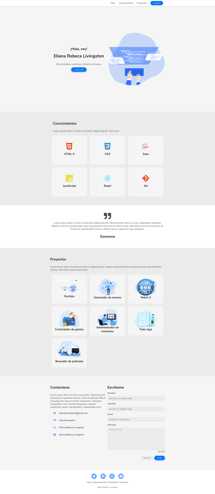

# Portafolio de ADA

Este proyecto está realizado para mostrar un ejemplo de como sería un portafolio para la entrega final del módulo 1 de ADA.
<br>
Si quieres puedes verlo dando click [aquí!](https://elianarlivingston.github.io/portafolioADA/)

## Comenzando!

***

Si quieres tener el código en tu computadora deberas seguir éstos pasos en tu terminal.

- Ir al [repositorio](https://github.com/elianarlivingston/portafolioADA) 
- Dale click al botón de forkear 
- Luego dale click al botón verde y copia la URL
- Ve hacia la consola de tu computador
- Colocar el comando ```git clone <url>``` con la URL del proyecto a clonar
- Entra a tu carpeta y abrelo en tu IDE

## Dependencias

***

Este proyecto no necesita la instalación de ninguna dependencia por ahora.

### Éste debería ser el resultado 

***



También puedes verlo desde netlify en el siguiente [enlace](https://blissful-dijkstra-26fe52.netlify.app)

## Agradecimientos

Este portafolio pudo realizarse gracias a nuestros docentes [Jonh](https://github.com/Jonhks) y [Laydy](https://github.com/leydyk93), en conjunto con mis compañeras! 💕

### De Eliana con 💜